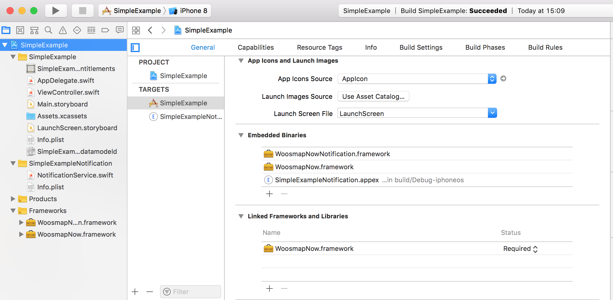
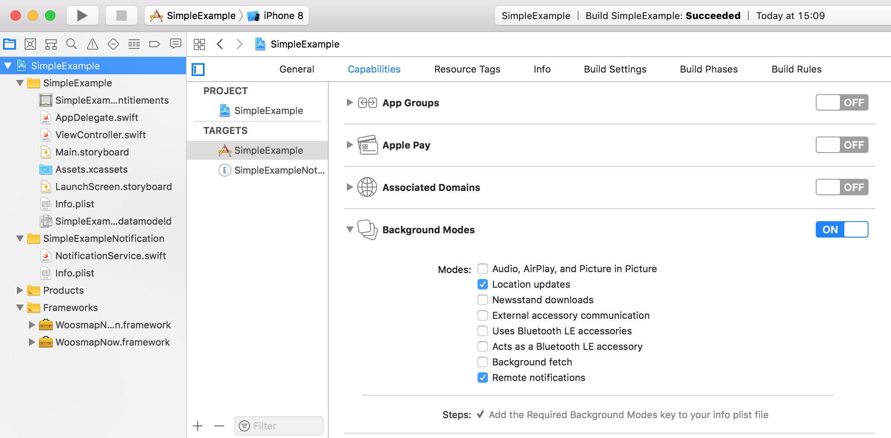
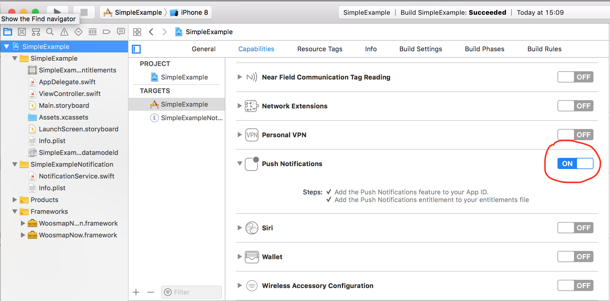
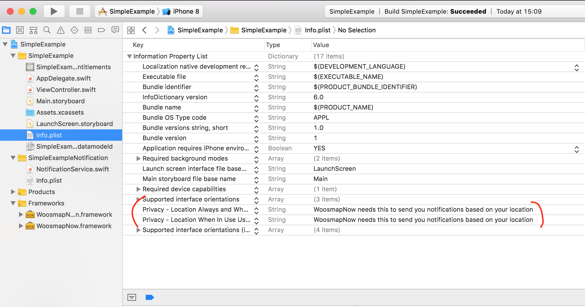

# ios_simple_example

First you need to embed our Frameworks



Make sure your have the proper capabilities checked





You also need to define two keys in the Info.plist : 

`NSLocationAlwaysAndWhenInUseUsageDescription` and `NSLocationWhenInUseUsageDescription`



The first step that should always be done each time your app is launched (in Foreground AND Background) is to set your Woosmap Private Key.
This should be done as early as possible in your `didFinishLaunchingWithOptions` App Delegate. 
Depending on your integration, you should call `startMonitoringInBackground` too. This method must also be called everytime your app is Launched. 

```swift
func application(_ application: UIApplication, didFinishLaunchingWithOptions launchOptions: [UIApplicationLaunchOptionsKey: Any]?) -> Bool {
        
    Now.shared.setPrivateKey(privateKey: "__YOUR_WOOSMAP_MOBILE_PRIVATE_KEY__")
    
    if (CLLocationManager.authorizationStatus() != .notDetermined) {
        Now.shared.startMonitoringInBackground()
    }
    
    return true
}
```

Before in fact using `startMonitoringInBackground` you should ask your user to allow us to get locations from his phone.

This must only be done the first time the app is launched with WoosmapNow or when the user wants to change his status, this setting is saved on our side.

You can do this using a simple view and a `UISwitch` : 

```swift
@IBAction func trackingChanged(_ sender: UISwitch) {
    Now.shared.updateUserTracking(tracking: sender.isOn)
}
```

Calling `startMonitoringInBackground` before setting `tracking` will stop WoosmapNow execution.

If `tracking` is set to `true` and if your user has not yet authorized your app to fetch locations, WoosmapNow will ask for it.
