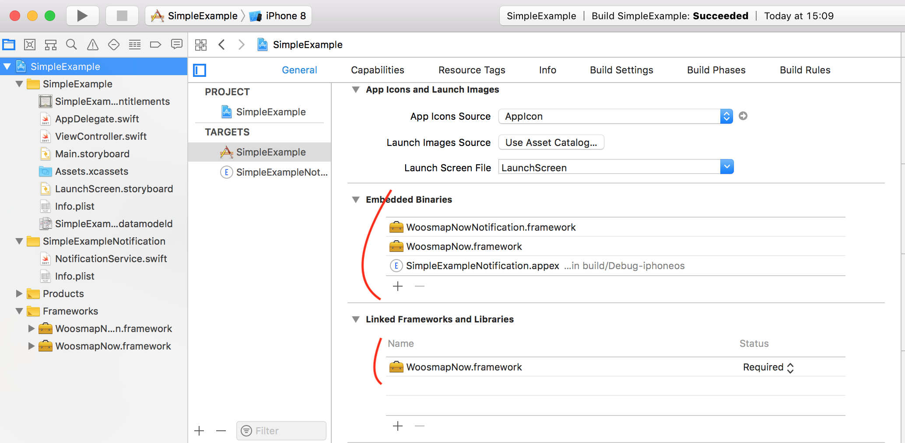
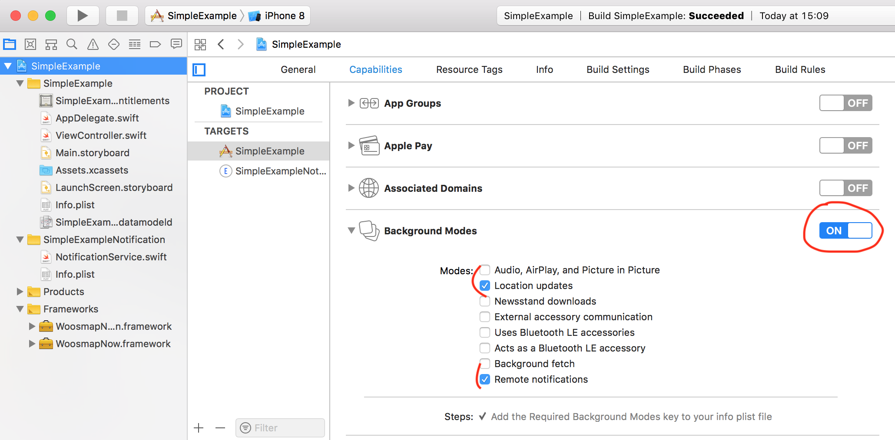
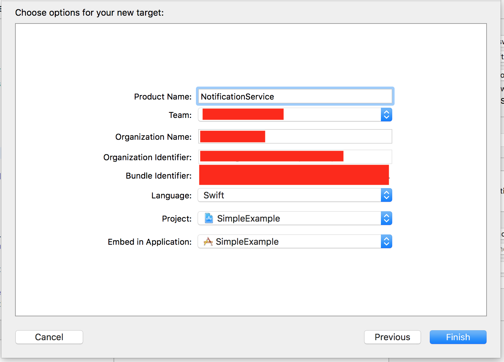

# ios_simple_example

## 1 - Setup

First you need to embed our Frameworks



Make sure your have the proper capabilities checked




You also need to define two keys in the `Info.plist`: 

`NSLocationAlwaysAndWhenInUseUsageDescription` and `NSLocationWhenInUseUsageDescription`


## 2 - Get Permission

Before in fact using tracking user locations you should ask your user to do so.

This must only be done the first time the app is launched with WoosmapNow or when the user wants to change his status, this setting is saved on our side.

You can do this using a simple view and a `UISwitch` : 

```swift
@IBOutlet weak var trackingSwitch: UISwitch!
    
override func viewDidLoad() {
    super.viewDidLoad()
    self.trackingSwitch.isOn = Now.shared.getUserTracking()
}

@IBAction func trackingSwitchChanged(_ sender: UISwitch) {
    Now.shared.updateUserTracking(tracking: sender.isOn)
}
```

Calling `startMonitoringInBackground` before setting `tracking` will stop WoosmapNow execution.

If `tracking` is set to `true` and if your user has not yet authorized your app to fetch locations, WoosmapNow will ask for it and start monitoring location changes.

## 3 - Tracking

The first step that should always be done each time your app is launched (in Foreground AND Background) is to set your Woosmap Private Key.
This should be done as early as possible in your `didFinishLaunchingWithOptions` App Delegate. 
Depending on your integration, you should call `startMonitoringInBackground` too. This method must also be called everytime your app is Launched. 

```swift
import WoosmapNow

func application(_ application: UIApplication, didFinishLaunchingWithOptions launchOptions: [UIApplicationLaunchOptionsKey: Any]?) -> Bool {
        
    Now.shared.setPrivateKey(privateKey: "__YOUR_WOOSMAP_MOBILE_PRIVATE_KEY__")
    
    if (CLLocationManager.authorizationStatus() != .notDetermined) {
        Now.shared.startMonitoringInBackground()
    }
    
    return true
}
```


## 4 - Rich notifications

To get notifications from Woosmap, you need to generate your certificates at https://developer.apple.com and upload them on https://console.woosmap.com.

You should already have checked Remote notification capabilies in the Setup.

If you haven't already, you should ask the user for permissions. Here is a snippet : 

```swift
import WoosmapNow
import UserNotifications

if #available(iOS 10, *) {
    UNUserNotificationCenter.current().delegate = self as? UNUserNotificationCenterDelegate
    UNUserNotificationCenter.current().requestAuthorization(options:[.badge, .alert, .sound]) { granted, error in }
} else {
    UIApplication.shared.registerUserNotificationSettings(UIUserNotificationSettings(types: [.badge, .sound, .alert], categories: nil))
}
UIApplication.shared.registerForRemoteNotifications()
```

You should have two function in your AppDelegate : `didFailToRegisterForRemoteNotificationsWithError` and `didRegisterForRemoteNotificationsWithDeviceToken`.

You need to give Woosmap Now the notification token each time the `AppDelegate.didRegisterForRemoteNotificationsWithDeviceToken` is called : 

```swift
func application(_ application: UIApplication, didRegisterForRemoteNotificationsWithDeviceToken deviceToken: Data){
    Now.shared.setRemoteNotificationToken(remoteNotificationToken: deviceToken)
}
```

If you want rich notifications (AKA with Image, subtitles and more...) you need to add a `NotificationService Extension` .




If you don't want to code your own, you can use the `WoosmapNowNotifications` framework we provide for default implementation. Add the framework to the `NotificationExtension Service`


And then, just extend `WoosmapNowNotification` class : 

```swift
import UserNotifications
import WoosmapNowNotification

class NotificationService: WoosmapNowNotification {

}
```


